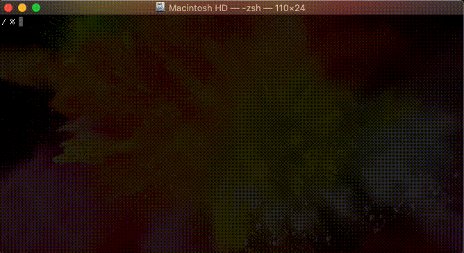

# ccd
Custom Change Directory: `cd` with built-in tree navigator

## Installation
1. `npm i -g ccd.js` or `yarn global add ccd.js`
2. In your `~/.zshrc`/`~/.bash_profile`, add `. $(npm bin -g)/ccd` or `. $(yarn global bin)/ccd`
3. Open a new shell (or source your shell profile)

## Usage
- `ccd` to start in the current directory
- <kbd>up</kbd>/<kbd>down</kbd>: change selection
- <kbd>right</kbd>: move into selected directory
- <kbd>left</kbd>: move to parent directory
- <kbd>enter</kbd>: `cd` to selected directory
- <kbd>space</kbd>: `cd` to open/active directory
- <kbd>esc</kbd>/<kbd>ctrl</kbd><kbd>c</kbd>: quit/cancel
